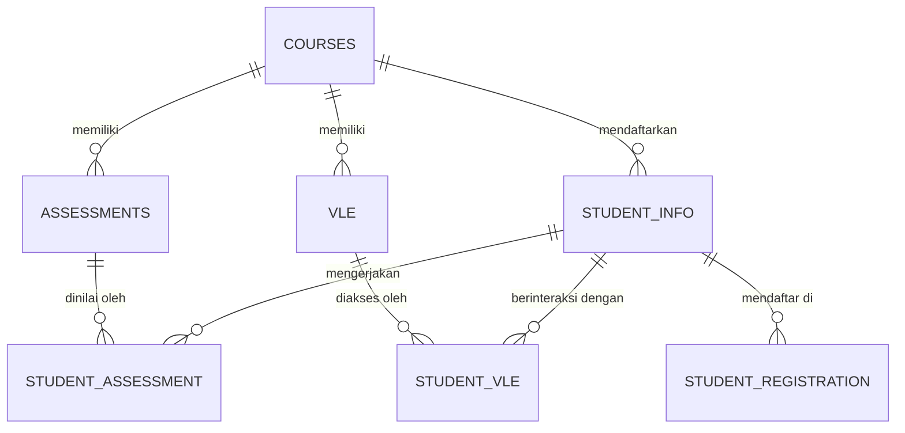
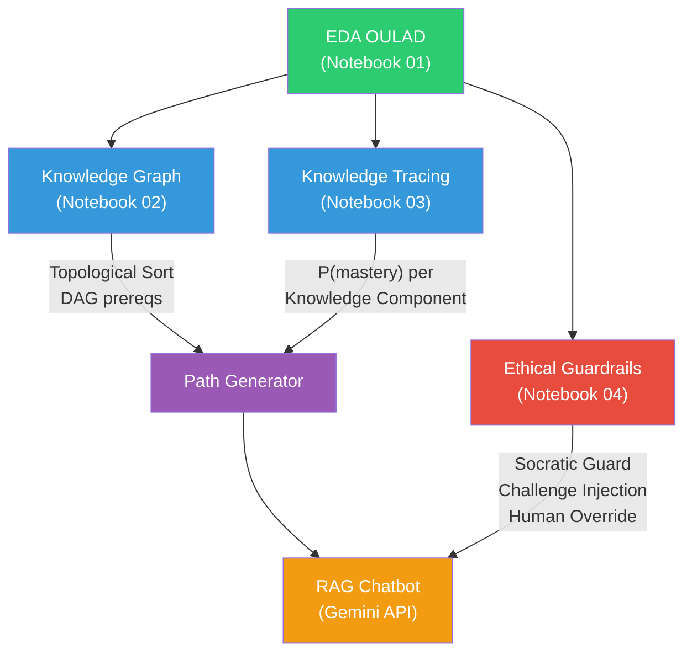

# 🎓 Exploratory Data Analysis Proyek AI Learning Path Chatbot
**Reasoning & Planning dalam AI**

---

## 1. Status Progress Keseluruhan Proyek

| No | Notebook | Status | Deskripsi |
| :---: | :--- | :---: | :--- |
| 1 | [01_eda_comprehensive.ipynb](file:///c:/Users/ratuc/OneDrive/Documents/ai-learningPath/01_eda_comprehensive.ipynb) | ✅ Selesai | EDA komprehensif 7 dataset OULAD (62 cells, 114KB) |
| 2 | [02_knowledge_graph_path.ipynb](file:///c:/Users/ratuc/OneDrive/Documents/ai-learningPath/02_knowledge_graph_path.ipynb) | 🔲 Belum | Knowledge Graph (DAG) + Topological Sort + Path Generator |
| 3 | [03_knowledge_tracing.ipynb](file:///c:/Users/ratuc/OneDrive/Documents/ai-learningPath/03_knowledge_tracing.ipynb) | 🔲 Belum | Bayesian Knowledge Tracing (pyBKT) + 5-Fold CV |
| 4 | [04_spaced_repetition_pipeline.ipynb](file:///c:/Users/ratuc/OneDrive/Documents/ai-learningPath/04_spaced_repetition_pipeline.ipynb) | 🔲 Belum | FSRS Scheduler + CLI Chatbot Simulator + Ethical Guardrails |
| 5 | Silabus Praktikum (3 JSON) | 🔲 Belum | DAG kurikulum untuk Orarkom, Database I, Struktur Data |
| 6 | Backend (FastAPI) | 🔲 Belum | REST API `/api/chat`, `/api/recommend`, `/api/submit-quiz` |
| 7 | Frontend (Next.js Web UI) | 🔲 Belum | Chat interface + Progress Tree + Tooltip Cards |

### Berkas Pendukung

| Berkas | Lokasi |
| :--- | :--- |
| Silabus Orarkom | [praktikum_orarkom.json](file:///c:/Users/ratuc/OneDrive/Documents/ai-learningPath/silabus/praktikum_orarkom.json) (8 topik) |
| Silabus Database I | [praktikum_database.json](file:///c:/Users/ratuc/OneDrive/Documents/ai-learningPath/silabus/praktikum_database.json) (10 topik) |
| Silabus Struktur Data | [praktikum_strukdat.json](file:///c:/Users/ratuc/OneDrive/Documents/ai-learningPath/silabus/praktikum_strukdat.json) (9 topik) |
| Kajian Etika | [ethical_impact_assessment.md](file:///C:/Users/ratuc/.gemini/antigravity/brain/298f32d8-e569-4ad9-ab29-20f19a5d0214/ethical_impact_assessment.md) |

---

## 2. Apa itu EDA dan Mengapa Dilakukan?

**EDA (Exploratory Data Analysis)** atau **Analisis Data Eksploratif** adalah proses awal dalam siklus Data Science di mana kita:
1. **Memahami struktur dan karakteristik data** sebelum membangun model apapun.
2. **Mengidentifikasi anomali** (missing values, outlier, duplikat) yang bisa merusak model.
3. **Menemukan pola dan hubungan** antar variabel yang menginformasikan desain algoritma.
4. **Mendeteksi bias dan ketimpangan** dalam data untuk memastikan keadilan sistem AI.

### Mengapa EDA Krusial untuk Proyek Ini?

Dalam konteks AI Learning Path Chatbot, EDA menjawab pertanyaan-pertanyaan fundamental:

| Pertanyaan | Dijawab oleh Section |
| :--- | :--- |
| Seberapa bersih data OULAD? Adakah missing values yang harus ditangani? | **Section 2** (Analisis Kualitas Data) |
| Bagaimana profil demografi mahasiswa? Apakah ada kelompok dominan? | **Section 3** (Analisis Univariat) |
| Apakah faktor sosial-ekonomi memengaruhi keberhasilan belajar? | **Section 4** (Analisis Bivariat) |
| Kapan mahasiswa cenderung berhenti (dropout)? Bisakah kita deteksi lebih awal? | **Section 5** (Analisis Perjalanan Mahasiswa) |
| Tipe materi VLE mana yang paling efektif untuk pembelajaran? | **Section 6** (Deep Dive VLE) |
| Apakah data kita mengandung diskriminasi algoritmik? | **Section 7** (Analisis Bias & Kesetaraan) |
| Fitur mana yang paling berkorelasi dengan keberhasilan untuk di-feed ke model? | **Section 8** (Rekayasa Fitur) |

---

## 3. Dataset OULAD — Penjelasan Lengkap

**OULAD** = **Open University Learning Analytics Dataset**, sebuah dataset publik dari The Open University (UK) yang mencatat aktivitas belajar ~32.000 mahasiswa di 7 modul kursus selama 4 semester.

Dataset ini terdiri dari **7 file CSV** yang saling terhubung melalui relasi kunci (*foreign key*):

---

### 3.1 `courses.csv` — Informasi Modul & Presentasi
**Jumlah baris:** 22 | **Jumlah kolom:** 3

Berisi metadata tentang modul kursus dan kapan modul tersebut diajarkan (presentasi/semester).

| Kolom | Tipe | Deskripsi Lengkap |
| :--- | :---: | :--- |
| `code_module` | `object` | **Kode modul kursus.** Terdapat 7 modul unik yang dianonimkan: **AAA, BBB, CCC, DDD, EEE, FFF, GGG**. Setiap modul mewakili satu mata kuliah berbeda di Open University. |
| `code_presentation` | `object` | **Kode presentasi (semester).** Format: `YYYY[B/J]` — contoh `2013J` berarti semester Februari 2013, `2014B` berarti semester Oktober 2014. **B = Oktober (musim gugur), J = Februari (musim semi).** Terdapat 4 semester: 2013B, 2013J, 2014B, 2014J. |
| `module_presentation_length` | `int64` | **Durasi modul dalam hari.** Lama waktu modul berlangsung sejak hari mulai hingga hari akhir. Biasanya berkisar antara **234–269 hari** (~8-9 bulan). |

---

### 3.2 `assessments.csv` — Detail Penilaian
**Jumlah baris:** 206 | **Jumlah kolom:** 6

Berisi informasi tentang setiap penilaian (tugas/ujian) yang tersedia di dalam modul.

| Kolom | Tipe | Deskripsi Lengkap |
| :--- | :---: | :--- |
| `code_module` | `object` | Kode modul tempat penilaian ini berada. Merujuk ke `courses.code_module`. |
| `code_presentation` | `object` | Semester di mana penilaian ini diberikan. Merujuk ke `courses.code_presentation`. |
| `id_assessment` | `int64` | **ID unik penilaian.** Setiap tugas atau ujian memiliki ID numerik yang unik secara global di seluruh dataset. |
| `assessment_type` | `object` | **Jenis penilaian.** Terdapat 3 tipe: **TMA** (Tutor Marked Assessment — tugas yang dinilai tutor), **CMA** (Computer Marked Assessment — tugas yang dinilai otomatis oleh komputer), **Exam** (ujian akhir). |
| `date` | `float64` | **Tanggal deadline penilaian** (relatif terhadap hari pertama modul). Hari ke-0 = hari modul dimulai. Contoh: `date=56` berarti deadline-nya 56 hari setelah modul dimulai. **Catatan:** Beberapa Exam memiliki NaN karena belum dijadwalkan. |
| `weight` | `float64` | **Bobot kontribusi penilaian** terhadap nilai akhir modul, dalam persentase (0–100). Total bobot semua penilaian dalam satu modul seharusnya = 100%. |

---

### 3.3 `studentInfo.csv` — Demografi & Hasil Akhir Mahasiswa
**Jumlah baris:** 32.593 | **Jumlah kolom:** 12

Dataset inti yang berisi profil demografis setiap mahasiswa beserta hasil akhir mereka. **Satu baris = satu pendaftaran mahasiswa di satu modul-presentasi.**

| Kolom | Tipe | Deskripsi Lengkap |
| :--- | :---: | :--- |
| `code_module` | `object` | Kode modul yang diambil mahasiswa. |
| `code_presentation` | `object` | Semester ketika mahasiswa mengambil modul tersebut. |
| `id_student` | `int64` | **ID unik mahasiswa.** Satu mahasiswa bisa muncul di beberapa baris jika mengambil beberapa modul atau mengulang modul. |
| `gender` | `object` | **Jenis kelamin.** Nilai: **M** (Male/Laki-laki) atau **F** (Female/Perempuan). |
| `region` | `object` | **Wilayah geografis tempat tinggal** mahasiswa di Inggris Raya. Contoh: `London Region`, `South East Region`, `Scotland`, `Ireland`, `East Anglian Region`, dll. Terdapat ~13 wilayah unik. |
| `highest_education` | `object` | **Tingkat pendidikan tertinggi** yang dimiliki mahasiswa saat mendaftar. Hierarki dari rendah ke tinggi: **No Formal quals** (tanpa kualifikasi formal) → **Lower Than A Level** (di bawah SMA) → **A Level or Equivalent** (setara SMA/diploma) → **HE Qualification** (kualifikasi pendidikan tinggi) → **Post Graduate Qualification** (pascasarjana). |
| `imd_band` | `object` | **Index of Multiple Deprivation (IMD) Band.** Indikator sosial-ekonomi wilayah tempat tinggal mahasiswa di Inggris. Skala: **0-10%** (paling miskin/deprived) hingga **90-100%** (paling sejahtera). Kolom ini memiliki **missing values** — mahasiswa yang data IMD-nya tidak tersedia. **Kolom ini sangat penting untuk analisis bias sosial-ekonomi.** |
| `age_band` | `object` | **Kelompok umur mahasiswa.** Nilai: **0-35** (muda), **35-55** (dewasa), **55<=** (senior). |
| `num_of_prev_attempts` | `int64` | **Jumlah percobaan sebelumnya** untuk modul yang sama. Nilai 0 = pertama kali mengambil modul. Nilai ≥1 = mahasiswa mengulang modul (pernah gagal/withdrawn sebelumnya). |
| `studied_credits` | `int64` | **Total kredit** yang sedang dipelajari mahasiswa pada semester tersebut. Berkisar 30–600 SKS. Semakin tinggi = beban studi lebih berat. |
| `disability` | `object` | **Status disabilitas.** Nilai: **Y** (Ya, memiliki disabilitas yang dideklarasikan) atau **N** (Tidak). ~10% mahasiswa memiliki disabilitas. |
| `final_result` | `object` | **Hasil akhir mahasiswa** di modul tersebut. Terdapat 4 nilai: **Distinction** (lulus dengan pujian, nilai tertinggi), **Pass** (lulus), **Fail** (gagal), **Withdrawn** (berhenti/dropout sebelum modul selesai). **Ini adalah target variabel utama analisis.** |

---

### 3.4 `studentAssessment.csv` — Skor Penilaian Mahasiswa
**Jumlah baris:** 173.912 | **Jumlah kolom:** 5

Berisi skor setiap mahasiswa untuk setiap penilaian yang mereka kumpulkan.

| Kolom | Tipe | Deskripsi Lengkap |
| :--- | :---: | :--- |
| `id_assessment` | `int64` | ID penilaian yang dikerjakan. Merujuk ke `assessments.id_assessment`. |
| `id_student` | `int64` | ID mahasiswa yang mengerjakan. Merujuk ke `studentInfo.id_student`. |
| `date_submitted` | `float64` | **Tanggal pengumpulan** (relatif terhadap hari pertama modul). Contoh: `date_submitted=30` berarti tugas dikumpulkan 30 hari setelah modul dimulai. **Jika dibandingkan dengan `assessments.date`, kita bisa mengetahui apakah mahasiswa mengumpulkan tepat waktu atau terlambat.** |
| `is_banked` | `int64` | **Apakah skor ini ditransfer dari semester sebelumnya.** Nilai: **1** = Ya (skor dari percobaan sebelumnya yang diakui), **0** = Tidak (skor dari pengerjaan semester ini). |
| `score` | `float64` | **Skor yang diperoleh** pada penilaian tersebut. Skala 0–100. Beberapa nilai melebihi 100 (bonus credit). **Missing values** menunjukkan penilaian yang tidak memiliki skor numerik (misal Exam yang belum dinilai). |

---

### 3.5 `studentRegistration.csv` — Data Registrasi Mahasiswa
**Jumlah baris:** 32.593 | **Jumlah kolom:** 5

Mencatat kapan mahasiswa mendaftar dan (jika ada) kapan mereka membatalkan registrasi.

| Kolom | Tipe | Deskripsi Lengkap |
| :--- | :---: | :--- |
| `code_module` | `object` | Kode modul yang didaftari. |
| `code_presentation` | `object` | Semester pendaftaran. |
| `id_student` | `int64` | ID mahasiswa yang mendaftar. |
| `date_registration` | `float64` | **Tanggal registrasi** (relatif terhadap hari pertama modul). **Nilai negatif** = mahasiswa mendaftar sebelum modul dimulai (misalnya -20 berarti 20 hari sebelum modul dimulai). Mayoritas mahasiswa mendaftar sebelum modul dimulai. |
| `date_unregistration` | `float64` | **Tanggal pembatalan registrasi** (relatif terhadap hari pertama modul). Jika **NaN/kosong** = mahasiswa **tidak membatalkan registrasi** dan menyelesaikan modul (baik lulus maupun gagal). Jika ada nilainya = mahasiswa melakukan **withdrawal** (berhenti) pada hari tersebut. |

---

### 3.6 `studentVle.csv` — Interaksi Mahasiswa dengan VLE
**Jumlah baris:** ~10.655.280 | **Jumlah kolom:** 6 | **Ukuran file:** ~453 MB

Dataset terbesar. Setiap baris mencatat total klik seorang mahasiswa pada satu situs/aktivitas VLE pada satu hari tertentu.

| Kolom | Tipe | Deskripsi Lengkap |
| :--- | :---: | :--- |
| `code_module` | `object` | Kode modul. |
| `code_presentation` | `object` | Semester. |
| `id_student` | `int64` | ID mahasiswa yang melakukan interaksi. |
| `id_site` | `int64` | **ID situs/aktivitas VLE** yang diakses. Merujuk ke `vle.id_site`. Setiap situs mewakili satu halaman atau aktivitas spesifik di dalam Virtual Learning Environment. |
| `date` | `int64` | **Tanggal interaksi** (relatif terhadap hari pertama modul). Hari ke-0 = modul dimulai. **Nilai negatif** = mahasiswa mengakses VLE sebelum modul resmi dimulai. |
| `sum_click` | `int64` | **Total klik** yang dilakukan mahasiswa pada situs tersebut pada hari tersebut. Bisa bernilai 1 (sekadar membuka halaman) hingga ratusan (interaksi intensif seperti mengerjakan kuis berulang kali). |

---

### 3.7 `vle.csv` — Metadata Aktivitas VLE
**Jumlah baris:** 6.364 | **Jumlah kolom:** 6

Berisi deskripsi setiap situs/aktivitas yang tersedia di Virtual Learning Environment.

| Kolom | Tipe | Deskripsi Lengkap |
| :--- | :---: | :--- |
| `id_site` | `int64` | **ID unik situs/aktivitas VLE.** Setiap aktivitas pembelajaran (halaman konten, forum, kuis, dll.) memiliki ID unik. |
| `code_module` | `object` | Modul tempat aktivitas ini berada. |
| `code_presentation` | `object` | Semester di mana aktivitas ini tersedia. |
| `activity_type` | `object` | **Tipe aktivitas VLE.** Terdapat ~20 tipe berbeda. Yang paling umum: **oucontent** (konten pembelajaran utama), **forumng** (forum diskusi), **subpage** (sub-halaman navigasi), **url** (tautan eksternal), **quiz** (kuis), **resource** (sumber daya unduhan), **page** (halaman info), **oucollaborate** (kolaborasi), **glossary** (glosarium), **homepage** (halaman beranda modul), dan lainnya. |
| `week_from` | `float64` | **Minggu mulai** aktivitas tersedia (relatif terhadap awal modul). Contoh: `week_from=3` berarti aktivitas mulai tersedia di minggu ke-3. **Memiliki missing values** jika periode tidak ditentukan. |
| `week_to` | `float64` | **Minggu berakhir** aktivitas tersedia. Contoh: `week_to=10` berarti aktivitas tersedia sampai minggu ke-10. **Memiliki missing values.** |

---

## 4. Alur Analisis EDA (8 Bagian)

### Section 1: Setup & Pemuatan Data
**Tujuan:** Memuat semua 7 dataset ke memori Google Colab.
- File `studentVle.csv` berukuran 453 MB sehingga dimuat secara **chunked** (per 500.000 baris) agar tidak memenuhi RAM Colab.
- Setiap dataset diinspeksi: jumlah baris × kolom, tipe data, memori yang digunakan, dan 5 baris pertama.

### Section 2: Analisis Kualitas Data
**Tujuan:** Memastikan data layak digunakan sebelum pemodelan.

Analisis yang dilakukan:
1. **Missing Values** — Heatmap + tabel persentase per dataset.
   - `imd_band` di studentInfo: data sosial-ekonomi sebagian mahasiswa tidak tersedia.
   - `date` di assessments: beberapa ujian akhir belum dijadwalkan.
   - `date_unregistration` di studentRegistration: NaN berarti mahasiswa **tetap terdaftar** (ini normal).
2. **Duplikat** — Mengecek apakah ada baris identik yang terulang.
3. **Validasi Tipe Data** — Memastikan setiap kolom memiliki tipe data yang sesuai.
4. **Deteksi Outlier** — Menggunakan metode **IQR (Interquartile Range)** pada kolom numerik:
   - `num_of_prev_attempts`: ada mahasiswa yang sudah mencoba hingga 6 kali.
   - `score`: beberapa skor melebihi 100 (bonus credit).
   - `studied_credits`: variasi dari 30 hingga 600+ SKS.

### Section 3: Analisis Univariat
**Tujuan:** Memahami distribusi setiap variabel secara individual.

Temuan utama:
- **Gender**: Distribusi relatif seimbang, sedikit lebih banyak perempuan.
- **Umur**: Mayoritas mahasiswa berusia 0-35 tahun.
- **Hasil Akhir**: Proporsi **Withdrawn** (~30%) dan **Fail** (~13%) sangat signifikan — hampir separuh mahasiswa tidak berhasil.
- **Disabilitas**: ~10% mahasiswa menyatakan memiliki disabilitas.
- **Assessment**: TMA (tugas manual) paling banyak, disusul CMA dan Exam.
- **VLE**: `oucontent` dan `forumng` adalah tipe aktivitas paling banyak.

### Section 4: Analisis Bivariat & Lintas Dataset
**Tujuan:** Menemukan hubungan antar variabel dari dataset berbeda.

Temuan utama:
- **IMD Band vs Hasil Akhir**: Mahasiswa dari daerah miskin (IMD rendah) memiliki tingkat kegagalan yang **lebih tinggi secara signifikan**.
- **Skor vs Hasil Akhir**: Mahasiswa Distinction memiliki rata-rata skor **80+**, sementara Withdrawn rata-rata **di bawah 50**.
- **VLE Klik vs Hasil Akhir**: **Temuan kunci** — mahasiswa sukses memiliki total klik VLE **jauh lebih banyak**. Ini mengonfirmasi bahwa engagement digital adalah prediktor utama keberhasilan.

### Section 5: Analisis Perjalanan Mahasiswa
**Tujuan:** Menganalisis timeline temporal mahasiswa dari registrasi hingga hasil akhir.

Temuan utama:
- Mayoritas mahasiswa mendaftar **sebelum modul dimulai** (tanggal negatif).
- Withdrawal terjadi **sepanjang modul**, namun ada konsentrasi di awal (minggu 1-4). Ini berarti early warning system bisa efektif.
- **VLE Engagement Temporal**: Mahasiswa Distinction menunjukkan klik yang konsisten tinggi. Mahasiswa Withdrawn menunjukkan **penurunan tajam** sebelum dropout — sinyal deteksi dini.
- **Ketepatan Waktu**: Mahasiswa berhasil cenderung mengumpulkan tugas lebih awal. Mahasiswa gagal/withdrawn lebih sering terlambat.

### Section 6: Deep Dive Aktivitas VLE
**Tujuan:** Memahami pola penggunaan platform pembelajaran secara mendalam.

Temuan utama:
- Setiap modul memiliki **profil aktivitas VLE yang berbeda** — ada yang lebih banyak menggunakan kuis, ada yang forum-heavy.
- **Heavy users (kuartil atas)** memiliki tingkat kelulusan (Pass + Distinction) yang jauh lebih tinggi dibandingkan Light users.
- Metrik agregat per mahasiswa: **hari aktif, situs unik dikunjungi, klik per hari, rentang engagement** — semua berkorelasi kuat dengan keberhasilan.

### Section 7: Analisis Bias & Kesetaraan
**Tujuan:** Mendeteksi dan mengukur potensi diskriminasi dalam data.

Analisis yang dilakukan:
1. **Disparate Impact Ratio (DIR)** — Menggunakan *Four-Fifths Rule*:
   - Jika DIR ≥ 0.8: Tidak ada indikasi diskriminasi.
   - Jika DIR < 0.8: Ada indikasi *disparate impact*.
   - Dihitung untuk dimensi: gender, umur, disabilitas, pendidikan, dan **IMD Band**.
2. **Uji Chi-Square** — Menguji signifikansi statistik hubungan antara variabel demografi dan hasil akhir:
   - **Cramer's V** untuk mengukur kekuatan asosiasi (kecil < 0.1, sedang 0.1-0.3, besar > 0.3).
   - `highest_education` kemungkinan memiliki effect size terbesar.

> [!IMPORTANT]
> **Temuan etis utama:** IMD Band rendah (mahasiswa dari daerah miskin) memiliki DIR yang di bawah 0.8 — artinya data mentah mengandung **ketimpangan struktural**. Inilah yang memotivasi pembangunan **Ethical Guardrails** pada chatbot AI.

### Section 8: Rekayasa Fitur & Ekspor Data
**Tujuan:** Membuat fitur-fitur numerik agregat yang siap di-feed ke model Machine Learning.

Fitur yang dibuat (total ~30 kolom):
- **Fitur VLE**: total_clicks, unique_sites, active_days, avg_clicks_per_day, engagement_span, max_daily_clicks.
- **Fitur Assessment**: avg_score, std_score, min/max_score, completion_rate, on_time_rate, weighted_score.
- **Fitur Registrasi**: date_registration, is_unregistered, days_enrolled, early_registration.

Output disimpan ke Google Drive:
- `student_master.csv` — satu baris per mahasiswa dengan semua fitur agregat.
- `vle_aggregated.csv` — statistik VLE per mahasiswa per modul.

---

## 5. Relevansi EDA dengan Komponen AI Learning Path Chatbot

| Temuan EDA | Komponen AI yang Dipengaruhi |
| :--- | :--- |
| 20 tipe aktivitas VLE + urutan temporal | Knowledge Graph (nodes = tipe aktivitas, edges = urutan waktu) |
| P(mastery) berbasis skor kuis | pyBKT parameters: P(init), P(learn), P(guess), P(slip) |
| DIR < 0.8 pada IMD Band rendah | Socioeconomic-Blind BKT + Challenge Injection |
| Heavy users sukses, light users gagal | FSRS Spaced Repetition scheduling |
| Withdrawal terdeteksi di awal modul | Early Warning → Adaptive Intervention |
