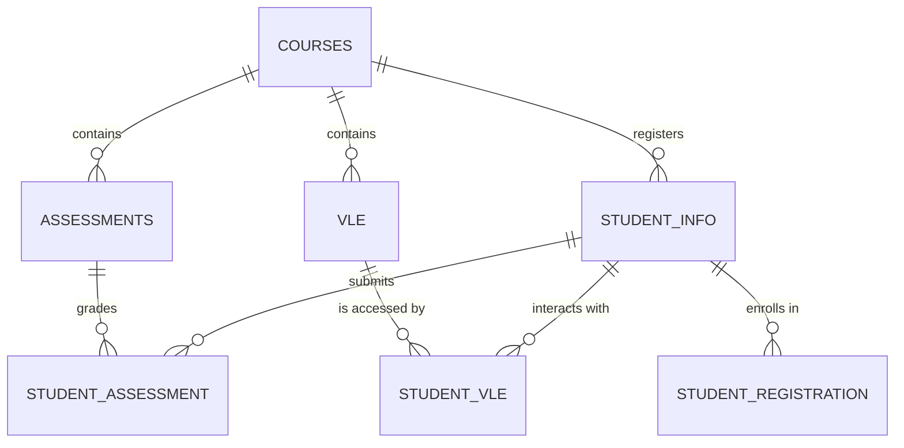

# 🎓 Exploratory Data Analysis: AI Learning Path Chatbot Project
**Reasoning & Planning in AI**

---

## 1. Overall Project Progress Status

| No | Notebook / Deliverable | Status | Description |
| :---: | :--- | :---: | :--- |
| 1 | [01_eda_comprehensive.ipynb](file:///c:/Users/ratuc/OneDrive/Documents/project%20AI/AI-LearningPath/notebook/01_eda_comprehensive.ipynb) | ✅ Completed | Comprehensive EDA of the 7 OULAD datasets (62 cells, 114KB) |
| 2 | [02_knowledge_graph_path.ipynb](file:///c:/Users/ratuc/OneDrive/Documents/project%20AI/AI-LearningPath/notebook/ai_learningpath.ipynb) | ✅ Completed | Knowledge Graph (DAG) + Topological Sort + Path Generator |
| 3 | [03_knowledge_tracing.ipynb](file:///c:/Users/ratuc/OneDrive/Documents/project%20AI/AI-LearningPath/notebook/ai_learningpath.ipynb) | ✅ Completed | Bayesian Knowledge Tracing (pyBKT) + 5-Fold CV |
| 4 | [04_spaced_repetition_pipeline.ipynb](file:///c:/Users/ratuc/OneDrive/Documents/project%20AI/AI-LearningPath/notebook/ai_learningpath.ipynb) | ✅ Completed | FSRS Scheduler + CLI Chatbot Simulator + Ethical Guardrails |
| 5 | Lab Syllabus (3 JSON files) | ✅ Completed | Curriculum DAGs for Computer Org, Database I, and Data Structures |
| 6 | Backend (FastAPI) | ✅ Completed | REST API endpoints (`/api/chat`, `/api/progress`, `/api/flashcard/review`) |
| 7 | Frontend (Next.js Web UI) | ✅ Completed | Chat interface + Syllabus Progress Tree + Dashboard stats |

### Supporting Files

| File | Location |
| :--- | :--- |
| Computer Org Syllabus | [praktikum_orarkom.json](file:///c:/Users/ratuc/OneDrive/Documents/project%20AI/AI-LearningPath/silabus/praktikum_orarkom.json) (8 topics) |
| Database I Syllabus | [praktikum_database.json](file:///c:/Users/ratuc/OneDrive/Documents/project%20AI/AI-LearningPath/silabus/praktikum_database.json) (10 topics) |
| Data Structures Syllabus | [praktikum_strukdat.json](file:///c:/Users/ratuc/OneDrive/Documents/project%20AI/AI-LearningPath/silabus/praktikum_strukdat.json) (9 topics) |
| Ethical Studies | [ethical_impact_assessment.md](file:///C:/Users/ratuc/.gemini/antigravity/brain/298f32d8-e569-4ad9-ab29-20f19a5d0214/ethical_impact_assessment.md) |

---

## 2. What is EDA and Why is it Done?

**EDA (Exploratory Data Analysis)** is the initial step in the Data Science lifecycle where we:
1. **Understand the structure and characteristics of the data** before building any predictive models.
2. **Identify anomalies** (missing values, outliers, duplicate rows) that could compromise model training.
3. **Discover patterns and relationships** between variables that inform algorithmic design.
4. **Detect biases and inequities** in the dataset to ensure fairness in downstream AI decisions.

### Why is EDA Crucial for This Project?

In the context of the AI Learning Path Chatbot, EDA provides answers to fundamental system design questions:

| Question | Answered by |
| :--- | :--- |
| How clean is the OULAD data? Are there missing values we must impute? | **Section 2** (Data Quality Analysis) |
| What is the demographic profile of the students? Are there highly dominant classes? | **Section 3** (Univariate Analysis) |
| Do socioeconomic factors affect learning success? | **Section 4** (Bivariate Analysis) |
| When do students tend to dropout? Can we detect it early enough to intervene? | **Section 5** (Student Journey Analysis) |
| Which Virtual Learning Environment (VLE) activities show the highest student engagement? | **Section 6** (VLE Deep Dive) |
| Does our training data contain structural bias? | **Section 7** (Bias & Equity Audit) |
| Which features are most predictive of student performance for model training? | **Section 8** (Feature Engineering) |

---

## 3. The OULAD Dataset — Full Explanation

**OULAD** (**Open University Learning Analytics Dataset**) is a public educational dataset released by The Open University (UK). It tracks the learning activities of ~32,000 students enrolled across 7 course modules over 4 semesters.

The dataset consists of **7 CSV files** connected via foreign keys:

---

### 3.1 `courses.csv` — Module & Presentation Info
**Row count:** 22 | **Column count:** 3

Contains metadata about course modules and the semesters (presentations) they were offered.

| Column | Type | Description |
| :--- | :---: | :--- |
| `code_module` | `object` | **Course module code.** Represents one of 7 unique anonymized courses: **AAA, BBB, CCC, DDD, EEE, FFF, GGG**. |
| `code_presentation` | `object` | **Presentation (semester) code.** Format: `YYYY[B/J]`. `2013J` represents the Spring semester starting in February 2013, and `2014B` represents the Autumn semester starting in October. **B = October, J = February.** |
| `module_presentation_length` | `int64` | **Presentation duration in days.** The length of the semester from start to finish. Typically ranges from **234 to 269 days** (~8-9 months). |

---

### 3.2 `assessments.csv` — Assessment Details
**Row count:** 206 | **Column count:** 6

Contains information about the quizzes, assignments, and exams scheduled for each course presentation.

| Column | Type | Description |
| :--- | :---: | :--- |
| `code_module` | `object` | Course module. References `courses.code_module`. |
| `code_presentation` | `object` | Presentation semester. References `courses.code_presentation`. |
| `id_assessment` | `int64` | **Unique assessment ID.** A globally unique key representing a specific assignment or exam. |
| `assessment_type` | `object` | **Assessment type.** Can be **TMA** (Tutor Marked Assessment), **CMA** (Computer Marked Assessment — graded automatically), or **Exam**. |
| `date` | `float64` | **Submission deadline date** (relative to the start of the module). Day 0 is the first day of the presentation. Example: `date=56` means the deadline is 56 days after the module starts. **Note:** Final Exams often have `NaN` values if they are unscheduled in the logs. |
| `weight` | `float64` | **Assessment weight** towards the final course grade (0%–100%). The sum of all assessment weights in a module presentation totals 100%. |

---

### 3.3 `studentInfo.csv` — Student Demographics & Final Outcomes
**Row count:** 32,593 | **Column count:** 12

The core student database containing demographic profiles and final academic results. **Each row represents one student enrollment in a specific module presentation.**

| Column | Type | Description |
| :--- | :---: | :--- |
| `code_module` | `object` | Course module code. |
| `code_presentation` | `object` | Semester code. |
| `id_student` | `int64` | **Unique student ID.** A student can appear in multiple rows if they enrolled in multiple courses or retook a course. |
| `gender` | `object` | **Gender.** Values: **M** (Male) or **F** (Female). |
| `region` | `object` | **Geographical region of residence** in the UK (e.g., `London Region`, `South East Region`, `Scotland`, `Ireland`, etc. 13 unique regions). |
| `highest_education` | `object` | **Highest education level** attained prior to entry. Order: **No Formal quals** → **Lower Than A Level** → **A Level or Equivalent** (High School) → **HE Qualification** (Higher Education) → **Post Graduate Qualification**. |
| `imd_band` | `object` | **Index of Multiple Deprivation (IMD) Band.** Socioeconomic rank of the student's residence area in the UK. Scale: **0-10%** (most deprived) to **90-100%** (most affluent). Contains **missing values** for missing student addresses. **Crucial for bias auditing.** |
| `age_band` | `object` | **Age bracket.** Values: **0-35**, **35-55**, **55<=**. |
| `num_of_prev_attempts` | `int64` | **Number of previous attempts** at this course module. `0` means first attempt, `1` or more indicates they are repeating after a previous failure or withdrawal. |
| `studied_credits` | `int64` | **Total credits** the student is studying concurrently in this presentation (ranges from 30 to 600 SKS). Higher credits imply heavier course loads. |
| `disability` | `object` | **Disability status.** Values: **Y** (Yes, declared disability) or **N** (No). ~10% of students have declared a disability. |
| `final_result` | `object` | **Final course outcome.** Values: **Distinction** (top honors), **Pass**, **Fail**, or **Withdrawn** (dropped out early). **This is the primary target variable for machine learning models.** |

---

### 3.4 `studentAssessment.csv` — Student Grades
**Row count:** 173,912 | **Column count:** 5

Contains individual scores achieved by students in their submitted assignments.

| Column | Type | Description |
| :--- | :---: | :--- |
| `id_assessment` | `int64` | Assessment ID. References `assessments.id_assessment`. |
| `id_student` | `int64` | Student ID. References `studentInfo.id_student`. |
| `date_submitted` | `float64` | **Submission day** (relative to the start of the module). For example, `date_submitted=30` means the assignment was uploaded on day 30. **Comparing this to the deadline in `assessments.date` tells us if the submission was on-time or late.** |
| `is_banked` | `int64` | **Banked status.** `1` means the grade was carried over from a previous semester attempt, `0` means it was graded in the current semester. |
| `score` | `float64` | **Grade score achieved** (scale 0-100). Some grades may exceed 100 due to bonus credits. **Missing values** denote assessments that were submitted but not numerically graded. |

---

### 3.5 `studentRegistration.csv` — Course Registration Log
**Row count:** 32,593 | **Column count:** 5

Mancatat enrollment timelines for each student.

| Column | Type | Description |
| :--- | :---: | :--- |
| `code_module` | `object` | Course module code. |
| `code_presentation` | `object` | Presentation semester. |
| `id_student` | `int64` | Student ID. |
| `date_registration` | `float64` | **Registration date** (relative to module start). **Negative values** indicate early registration (e.g., `-20` means registration occurred 20 days prior to the start of classes). |
| `date_unregistration` | `float64` | **Unregistration date** (relative to module start). **NaN/Empty** values indicate the student **did not unregister** and completed the course (whether passing or failing). A numerical value indicates the day the student **withdrew (withdrawn/dropped out)**. |

---

### 3.6 `studentVle.csv` — Student-VLE Click Activity Logs
**Row count:** ~10,655,280 | **Column count:** 6 | **File size:** ~453 MB

The largest table in the dataset. Each row tracks the daily click aggregation for a specific student accessing a VLE site.

| Column | Type | Description |
| :--- | :---: | :--- |
| `code_module` | `object` | Course module code. |
| `code_presentation` | `object` | Presentation semester. |
| `id_student` | `int64` | Student ID. |
| `id_site` | `int64` | **VLE site/activity ID.** References `vle.id_site`. |
| `date` | `int64` | **Interaction day** (relative to module start). Negative values show pre-semester activity. |
| `sum_click` | `int64` | **Number of clicks** on the VLE page by the student on this specific day. Ranges from 1 to hundreds. |

---

### 3.7 `vle.csv` — VLE Activity Metadata
**Row count:** 6,364 | **Column count:** 6

Describes the types of resources and tasks configured in the Virtual Learning Environment.

| Column | Type | Description |
| :--- | :---: | :--- |
| `id_site` | `int64` | **Unique VLE site ID.** |
| `code_module` | `object` | Module code. |
| `code_presentation` | `object` | Presentation code. |
| `activity_type` | `object` | **Activity category.** Includes ~20 types, most commonly: **oucontent** (core reading material), **forumng** (discussion board), **subpage** (navigation menu), **url** (hyperlink), **quiz**, **resource** (downloadable documents), **page**, **oucollaborate** (live meetings), **glossary**, **homepage** (module landing page). |
| `week_from` | `float64` | **Starting week** the activity is recommended for. Contains missing values if unspecified. |
| `week_to` | `float64` | **Ending week** the activity is recommended for. |

---

## 4. EDA Analysis Workflow (8 Sections)

### Section 1: Setup & Data Loading
**Goal:** Import all 7 datasets into Google Colab memory.
- The `studentVle.csv` file (~453 MB) is loaded using **chunked reading** (chunks of 500,000 rows) to prevent Colab from exceeding RAM limits.
- Shape, data types, memory usage, and first rows are validated for each table.

### Section 2: Data Quality Analysis
**Goal:** Inspect cleanliness and prepare the data.
- **Missing Values:** Plotted via heatmaps. `imd_band` contains missing values (students with unregistered addresses), which need to be addressed. `date_unregistration` has empty fields representing students who **remained enrolled** until semester end (which is structurally normal).
- **Duplicate Rows:** Checked and removed if found.
- **Data Type Validation:** Verified date columns are numeric.
- **Outlier Detection:** Computed via the **IQR (Interquartile Range)** method on numerical columns:
  - `num_of_prev_attempts`: Outliers exist for students who retook a course up to 6 times.
  - `studied_credits`: Extreme values identify students taking up to 600 concurrent credits.

### Section 3: Univariate Analysis
**Goal:** Examine the distribution of individual variables.
- **Gender:** Fairly balanced, with a slightly higher proportion of male students.
- **Age:** The vast majority of students are in the 0-35 age bracket.
- **Final Result:** A high dropout/withdrawal rate is apparent (~30% Withdrawn, ~13% Fail), meaning almost half of enrolled students do not complete courses successfully.
- **VLE Activity Types:** `oucontent` (core texts) and `forumng` (discussions) represent the bulk of digital interactions.

### Section 4: Bivariate & Cross-Dataset Analysis
**Goal:** Correlate characteristics across tables.
- **IMD Band vs Final Result:** Students residing in low-IMD (deprived) neighborhoods suffer from significantly **higher fail and withdrawal rates**.
- **Assessment Scores vs Final Result:** Distinction students maintain average scores above **80**, while withdrawn students average **below 50** on their submitted work.
- **VLE Clicks vs Final Result:** **Key Finding** — students who pass or achieve distinctions exhibit **vastly higher VLE click rates** than failing or withdrawing students. Digital engagement is highly predictive of academic success.

### Section 5: Student Journey Analysis
**Goal:** Track time-series events from enrollment to semester end.
- Most students register **prior to module start** (negative days).
- Withdrawals happen throughout the semester, but peak during the first 1-4 weeks. Early warning alerts are necessary during this window.
- **Temporal Click Patterns:** Distinction students maintain consistent engagement. Dropping students show a **steep drop-off** in clicks weeks before officially withdrawing, which serves as a predictive warning sign.

### Section 6: VLE Activity Deep Dive
**Goal:** Analyze specific digital curriculum profiles.
- Different course modules have **distinct digital footprints** (some are exam-heavy, others depend heavily on discussion forums).
- **Heavy VLE Users (top quartile)** have a higher passing rate than light users.
- Composite indicators per student (active days, unique sites visited, clicks per active day) are strongly correlated with final scores.

### Section 7: Bias & Equity Analysis
**Goal:** Detect algorithmic discrimination and structural inequalities.
- **Disparate Impact Ratio (DIR):** Calculated using the *Four-Fifths Rule* across demographics (gender, disability, age, and **IMD socioeconomic bands**).
- **Chi-Square Test & Cramer's V:** Measured statistical dependency of final results on student demographics.
- **Ethical Finding:** Low IMD bands (deprived students) have a DIR **below 0.8**, indicating structural inequities. This motivates the design of **Ethical Guardrails** in our tutoring system to avoid perpetuating biases.

### Section 8: Feature Engineering & Data Export
**Goal:** Construct student-level aggregated tables for Machine Learning model training (e.g., Random Forest Classifier).
- **VLE Aggregates:** `total_clicks`, `unique_sites`, `active_days`, `avg_clicks_per_day`, `engagement_span`.
- **Assessment Aggregates:** `avg_score`, `std_score`, `completion_rate`, `on_time_rate`, `weighted_score`.
- **Registration Aggregates:** `days_enrolled`, `early_registration`.
- **Exports:** Saved as `student_master.csv` (1 row per student with all engineered features) and `vle_aggregated.csv`.

---

## 5. Relevance of EDA to the AI Learning Path Chatbot Components

| EDA Finding | Affected AI Component / Algorithm |
| :--- | :--- |
| 20 VLE activity types + temporal sequences | Knowledge Graph (nodes = activity types, edges = temporal order) |
| Quiz score-based BKT parameters | pyBKT parameter training: P(init), P(learn), P(guess), P(slip) |
| DIR < 0.8 in low IMD Bands | Socioeconomic-Blind BKT + Challenge Injection in RAG |
| Heavy users succeed, light users fail | FSRS Spaced Repetition flashcard intervals |
| Withdrawal spikes during early weeks | **Early Warning System (Random Forest)** -> Adaptive Intervention |
